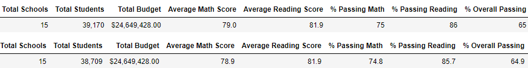
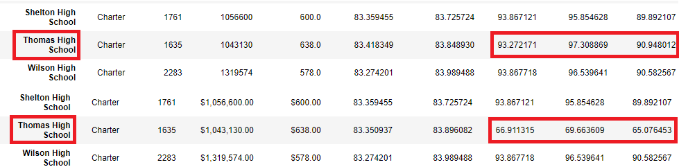
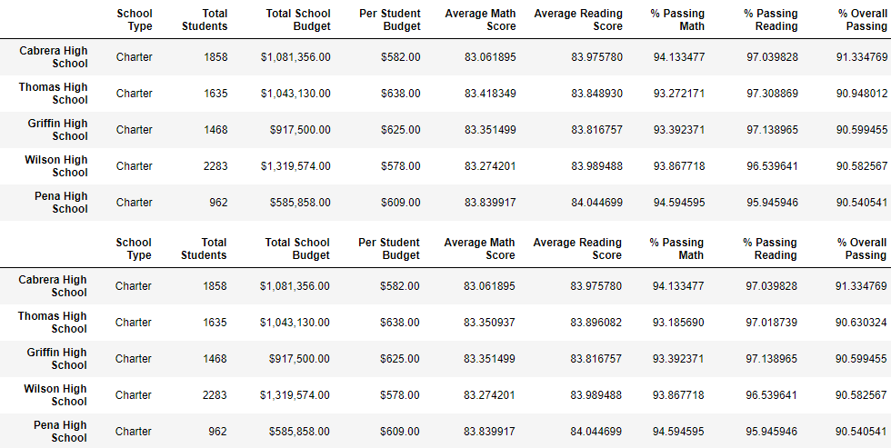

# School District Analysis

## Analysis Overview
After the school district analysis was initially peformed, evidence of potential academic dishonesty was discovered at one of the included schools. With this revelation, the purpose here is to remove the 9th graders of Thomas High School -- the source of the alleged academic dishonesty -- from the analysis, and perform the analysis anew after determining new values for Thomas High School after their exclusion.

## Results
- The school district summary was affect minimally by the exclusion of Thomas High School's 9th graders, as shown below. The average score for reading experienced no change, and the average math score dropped by 0.1. There was slightly more of an affect on the percentages. However, the drop was by less than a full percent in both cases, and had an even slighter affect on the overall percentage.

- The school summary is only affected in that Thomas High School's numbers have changed. No evidence of academic dishonesty was found at the other schools, so their numbers remained the same.

- Looking at Thomas High School next to the other schools, there is a dramatic change. This is displayed below, with Shelton High School and Wilson High School for comparison, and prior analysis above the new analysis sans 9ths graders.

While the passing reading scores and passing writing scores experience a minor dip, there is a huge drop in the percentages. Before, Thomas High School was about on par with the surrounding schools, but taking out the 9th graders drops the passing percentages in math, reading, and overall by nearly 30%. 

- There was no change to the math and reading scores by grade.

- There was no change to the scores by spending.

- There was no change to the scores by school size; Thomas High School remains a medium sized school even discounting the 9th graders.

- There was no change to the scores by school type.

- Noteworthy is the top 5 schools in the district. Despite the academic dishonesty, Thomas High School remains second, only behind Cabrera High School. The lower numbers in the district overall were not enough to displace them.

## Summary
After analyzing the data without the Thomas High School there are not many changes to report, and the changes that are present have a greater impact on Thomas High School itself than the school district as a whole.

The changes that can be found in the data are as follows: 
- the average scores and average passing percentages for the district are lower, but this drop is not likely enough to be statistically significant.
- The passing percentages for Thomas High School specifically are much lower, and this change is not enough to remove them from the top 5 schools.
- In the top 5 schools, Thomas High School's placement is more neck and neck with Griffin High School than it was previously.

